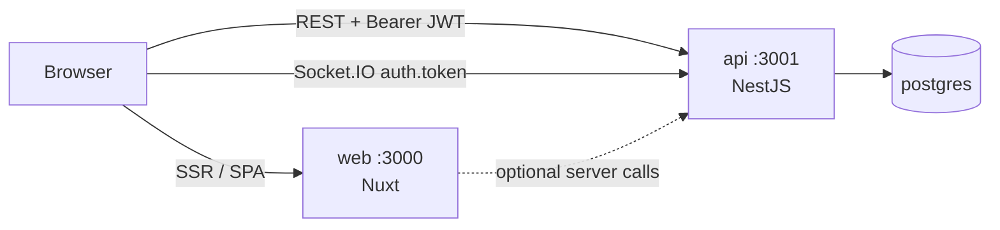
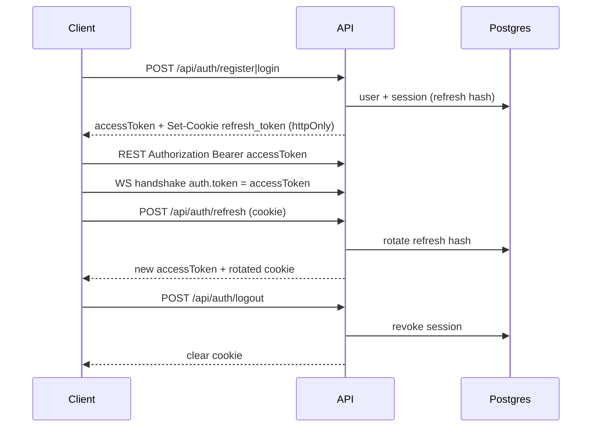

# Libheros Task Management

[](https://github.com/MouadCh/libheros-task-management/actions/workflows/ci.yml)
[](https://bun.sh)
[](https://www.typescriptlang.org/)
[](https://nestjs.com)
[](https://nuxt.com)
[](https://www.postgresql.org/)
[](https://www.prisma.io/)
[](https://socket.io)
[](https://docs.docker.com/compose/)

> Full-stack collaborative task manager built as a Bun monorepo — NestJS API, Nuxt 3 SPA, Prisma + PostgreSQL, and authenticated Socket.IO rooms.

**Author:** [Mouad Chafai](https://github.com/MouadCh) · **Repo:** [libheros-task-management](https://github.com/MouadCh/libheros-task-management)

---

## Table of contents

- [Why this project](#why-this-project)
- [Features](#features)
- [Quick start (Docker)](#quick-start-docker)
- [Local development](#local-development)
- [Stack](#stack)
- [Repository layout](#repository-layout)
- [Architecture](#architecture)
- [Authentication](#authentication)
- [Security](#security)
- [Realtime events](#realtime-events)
- [HTTP API surface](#http-api-surface)
- [Environment](#environment)
- [Scripts](#scripts)
- [Quality & CI](#quality--ci)
- [Trade-offs](#trade-offs)
- [With more time](#with-more-time)
- [Status](#status)

---

## Why this project

Tech-test implementation focused on production habits: ownership-scoped APIs, refresh-token rotation, typed contracts shared across REST and WebSockets, Docker delivery, and a CI pipeline that mirrors what reviewers can run locally.

```text
Browser ──REST + JWT──► Nest API ──Prisma──► PostgreSQL
   │                         ▲
   └──Socket.IO rooms────────┘
        (list:{listId})
```

---

## Features

| Area              | What you get                                                                                      |
| ----------------- | ------------------------------------------------------------------------------------------------- |
| **Auth**          | Register / login, short-lived access JWT, httpOnly refresh cookie with rotation & reuse detection |
| **Lists & tasks** | CRUD, status transitions, due dates, ownership isolation (foreign IDs → 404)                      |
| **Realtime**      | Authenticated gateway; join/leave list rooms; fan-out create/update/delete/complete               |
| **Web UI**        | Nuxt 3 + Pinia workspace: sidebar lists, task board, detail panel, session restore                |
| **Contracts**     | `@libheros/contracts` DTOs, enums, and event names shared by API + web                            |
| **Ops**           | Multi-stage Docker images, Compose stack, health checks, Swagger, Husky + GitHub Actions          |

---

## Quick start (Docker)

**Requirements:** [Docker](https://docs.docker.com/get-docker/) + Compose v2. Bun is optional if you only use Docker.

```bash
git clone https://github.com/MouadCh/libheros-task-management.git
cd libheros-task-management
cp .env.example .env
bun run docker:up          # or: docker compose up --build
```

| Service | URL                              |
| ------- | -------------------------------- |
| Web     | http://localhost:3000            |
| API     | http://localhost:3001/api        |
| Health  | http://localhost:3001/api/health |
| Swagger | http://localhost:3001/api/docs   |

**Useful variants**

```bash
bun run docker:up:detach   # background
bun run docker:down        # stop stack
```

Compose brings up PostgreSQL, runs `prisma migrate deploy` on API boot, then starts Nuxt. Browser API/WS URLs are baked into the web image via `NUXT_PUBLIC_*` build args (defaults point at `localhost:3001`).

> **Disk tip:** If Postgres fails with `No space left on device`, free Docker Desktop disk (`docker system prune`) and retry. A corrupted volume can be reset with `docker compose down -v` (wipes local DB data).

---

## Local development

**Requirements:** [Bun](https://bun.sh) `1.2.0` + Docker (Postgres only).

```bash
bun install
cp .env.example .env
bun run db:setup           # postgres + prisma generate + migrate
bun run dev                # API + web
```

| App | Command           | URL                       |
| --- | ----------------- | ------------------------- |
| API | `bun run dev:api` | http://localhost:3001/api |
| Web | `bun run dev:web` | http://localhost:3000     |

`DATABASE_URL` in `.env` uses `localhost` for Bun. The Compose `api` service overrides the host to `postgres`.

---

## Stack

| Layer        | Choice                                                                                             |
| ------------ | -------------------------------------------------------------------------------------------------- |
| Runtime / PM | [Bun](https://bun.sh) 1.2 — CI / `packageManager`: **1.2.0**; Docker images: **`oven/bun:1.2.23`** |
| API          | [NestJS](https://nestjs.com) 11, Prisma, Socket.IO, Helmet, Throttler, Swagger                     |
| Web          | [Nuxt](https://nuxt.com) 3, Vue 3, Pinia, Tailwind CSS, `socket.io-client`                         |
| Shared       | `@libheros/contracts` (DTOs, `TaskStatus`, WS event constants)                                     |
| Database     | PostgreSQL 16                                                                                      |
| Quality      | ESLint 9, Prettier, Husky, lint-staged                                                             |
| Tests        | Jest (API unit + e2e)                                                                              |
| Delivery     | Multi-stage Dockerfiles, Docker Compose                                                            |

---

## Repository layout

```text
apps/
  api/            NestJS REST + WebSocket API, Prisma, e2e tests
  web/            Nuxt 3 frontend
packages/
  contracts/      Shared TypeScript types & realtime event names
.github/
  workflows/      CI pipeline
  actions/        Reusable Bun setup + install cache
```

---

## Architecture



**Realtime model**

- Rooms are scoped per list: `list:{listId}`.
- Clients emit `list:join` / `list:leave` after the socket authenticates.
- Mutations in list/task services publish typed events to room members via an in-process publisher.

---

## Authentication



1. **Register / login** — validate credentials; return access JWT; set httpOnly refresh cookie (`path=/api/auth`, `SameSite=Lax`).
2. **REST** — `Authorization: Bearer <accessToken>`.
3. **Refresh** — rotate refresh token; detect reuse and revoke.
4. **Logout** — revoke session and clear cookie.
5. **WebSocket** — `socket.handshake.auth.token` (`WS_AUTH_TOKEN_KEY`); unauthenticated sockets are rejected; join checks list ownership.

On the web client, the access token lives **in memory** (Pinia / session ref) — not `localStorage`.

---

## Security

| Concern        | Approach                                                                               |
| -------------- | -------------------------------------------------------------------------------------- |
| Ownership      | Queries scoped by authenticated `userId`; cross-user IDs → **404** (no existence leak) |
| Passwords      | Argon2id hashing                                                                       |
| Access JWT     | Short TTL; held in memory on the client                                                |
| Refresh        | httpOnly cookie; hashed at rest; rotation + reuse detection                            |
| CORS           | Allow-list via `CORS_ORIGINS` / `FRONTEND_ORIGIN`, `credentials: true`                 |
| HTTP hardening | Helmet; ValidationPipe `whitelist` + `forbidNonWhitelisted`                            |
| WebSocket      | Same access JWT; ownership check before room join                                      |
| Rate limiting  | Nest Throttler on sensitive routes                                                     |

Secrets in `.env.example` are **local/dev placeholders only**. Replace before any shared deployment; set `COOKIE_SECURE=true` behind TLS.

---

## Realtime events

Defined in `@libheros/contracts`.

### Client → server

| Event        | Purpose                  |
| ------------ | ------------------------ |
| `list:join`  | Subscribe to a list room |
| `list:leave` | Unsubscribe              |

### Server → client

| Event            | Purpose               |
| ---------------- | --------------------- |
| `task:created`   | Task added            |
| `task:updated`   | Task edited           |
| `task:deleted`   | Task removed          |
| `task:completed` | Task marked completed |
| `list:created`   | List created          |
| `list:deleted`   | List deleted          |

---

## HTTP API surface

Interactive docs: [Swagger UI](http://localhost:3001/api/docs) (when the API is running).

| Group  | Methods (prefix `/api`)                                                 |
| ------ | ----------------------------------------------------------------------- |
| Health | `GET /health`                                                           |
| Auth   | `POST /auth/register`, `/login`, `/refresh`, `/logout` · `GET /auth/me` |
| Lists  | `GET                                                                    | POST /lists`·`DELETE /lists/:listId`·`GET | POST /lists/:listId/tasks`                           |
| Tasks  | `GET                                                                    | PATCH                                     | DELETE /tasks/:taskId`·`PATCH /tasks/:taskId/status` |

---

## Environment

Copy `.env.example` → `.env`. Highlights:

| Variable                                          | Notes                                                             |
| ------------------------------------------------- | ----------------------------------------------------------------- |
| `DATABASE_URL`                                    | Local Bun → `localhost`; Compose API overrides host to `postgres` |
| `FRONTEND_ORIGIN` / `CORS_ORIGINS`                | Browser origins allowed by the API                                |
| `NUXT_PUBLIC_API_BASE_URL` / `NUXT_PUBLIC_WS_URL` | Embedded at **web image build** time for Docker                   |
| `JWT_*` / `COOKIE_SECURE`                         | Auth secrets and cookie flags                                     |

Prefer **URL-safe** characters in `POSTGRES_PASSWORD` when Compose builds `DATABASE_URL`.

---

## Scripts

| Command                           | Description                         |
| --------------------------------- | ----------------------------------- |
| `bun run docker:up`               | Build & run postgres + api + web    |
| `bun run docker:up:detach`        | Same, detached                      |
| `bun run docker:down`             | Stop Compose stack                  |
| `bun run dev`                     | Dev mode — all workspaces           |
| `bun run dev:api` / `dev:web`     | Dev — single app                    |
| `bun run build`                   | Build all workspaces                |
| `bun run lint` / `typecheck`      | Static checks                       |
| `bun run test` / `test:e2e`       | Unit + API e2e                      |
| `bun run format` / `format:check` | Prettier                            |
| `bun run ci`                      | Full local CI pipeline              |
| `bun run db:up`                   | Postgres only                       |
| `bun run db:setup`                | DB up + generate + migrate          |
| `bun run db:migrate`              | Prisma migrate (dev)                |
| `bun run codegen`                 | Build contracts + `prisma generate` |

---

## Quality & CI

**Pre-commit** — Husky + lint-staged (ESLint + Prettier on staged files).

**GitHub Actions** (`.github/workflows/ci.yml`) on push/PR to `main`, with Bun install cache:

```text
format:check → lint → typecheck → test → test:e2e → build
```

```bash
bun run ci
```

---

## Trade-offs

| Decision                          | Rationale / cost                                                                                                                                           |
| --------------------------------- | ---------------------------------------------------------------------------------------------------------------------------------------------------------- |
| **Bun as single toolchain**       | One PM/runtime for Nest + Nuxt + scripts. CI stays on `1.2.0`; Docker pins `1.2.23` because `1.2.0` fails `@prisma/client` resolution during image builds. |
| **Shared contracts package**      | REST & Socket.IO stay in sync without publishing to npm for this test.                                                                                     |
| **Nuxt public env at build time** | Correct for static runtime config; changing `NUXT_PUBLIC_*` requires rebuilding the web image. Local `nuxt dev` reads env at runtime.                      |
| **Migrate on API start**          | Smooth Compose DX (`exec` keeps Nest as PID 1). Multi-replica prod should run migrations as a one-shot job.                                                |
| **No Redis Socket.IO adapter**    | Enough for single-node rooms; horizontal scale needs pub/sub + sticky sessions.                                                                            |
| **Postgres published on `:5432`** | Lets local Bun use `localhost`; tighten for shared hosts.                                                                                                  |

---

## With more time

- Redis adapter + sticky sessions for Socket.IO
- Multi-user list sharing beyond owner-only rooms
- OpenAPI-generated web client
- Metrics, tracing, correlation IDs end-to-end
- Strict prod secret gating / rotation; TLS + `COOKIE_SECURE=true`
- Broader frontend unit & e2e coverage
- Frozen lockfile for Docker production dependency stage

---

## Status

| Phase | Scope                           | State   |
| ----- | ------------------------------- | ------- |
| 0–1   | Scaffold, DB foundations        | Done    |
| 2–4   | Auth, lists/tasks, WebSocket    | Done    |
| 5–7   | Nuxt auth, UI, realtime client  | Done    |
| 8     | Unit + e2e + isolation          | Done    |
| 9     | Docker, Compose, CI cache, docs | Done    |
| 10    | Full verification / smoke       | Planned |

Roadmap checklist: [PLAN.md](./PLAN.md).

---

<p align="center">
  <sub>Built with Bun · NestJS · Nuxt · Prisma · PostgreSQL · Socket.IO</sub>
</p>
